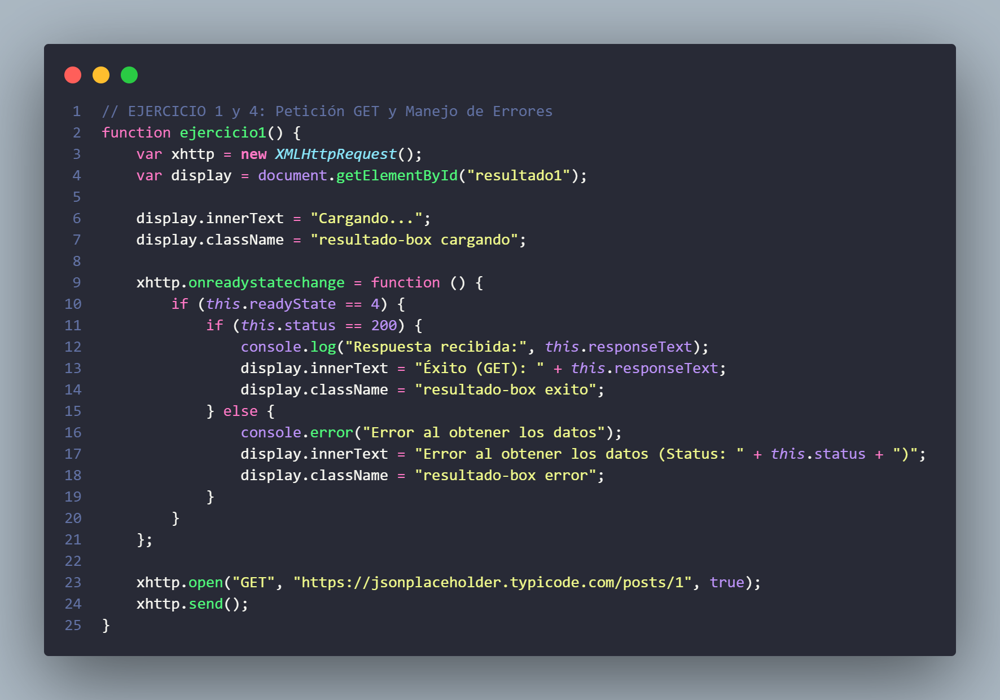
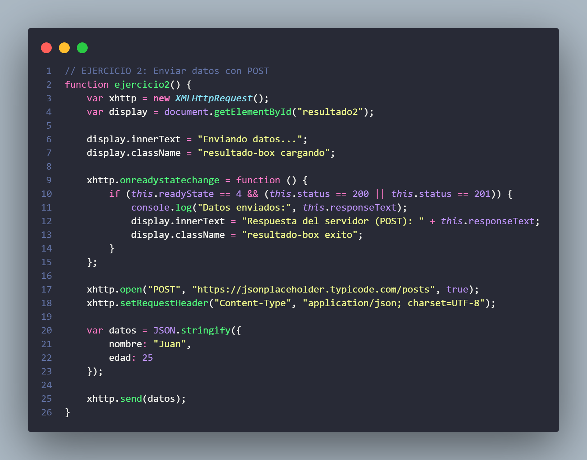
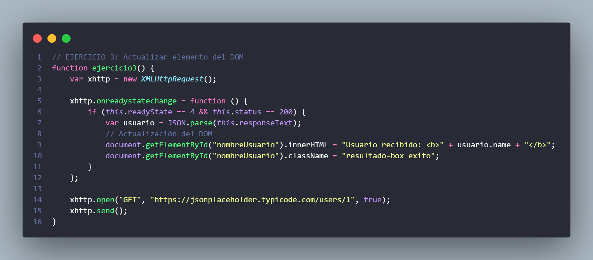
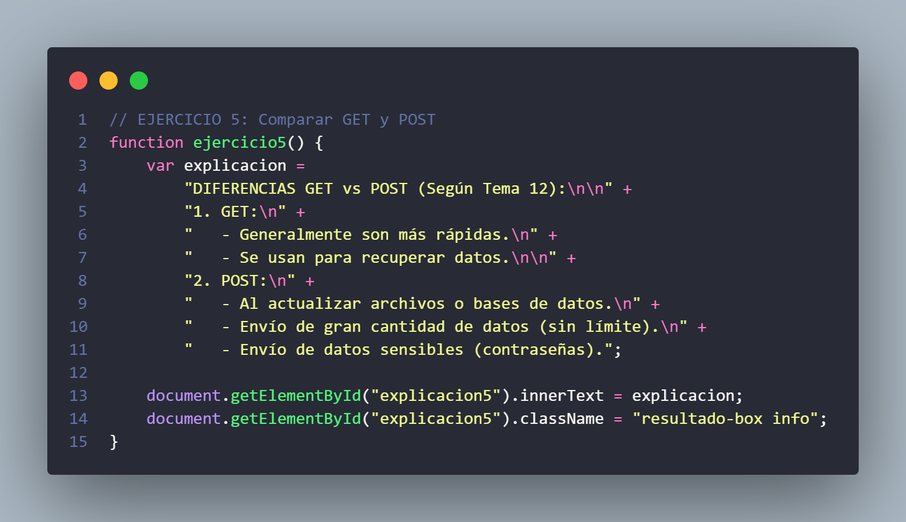
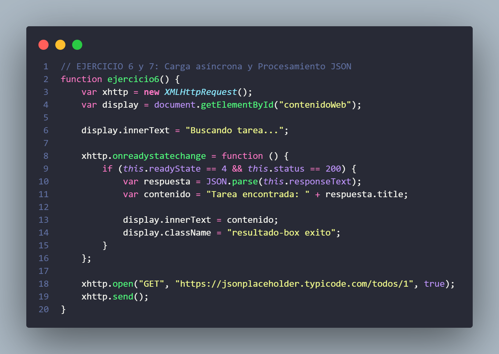
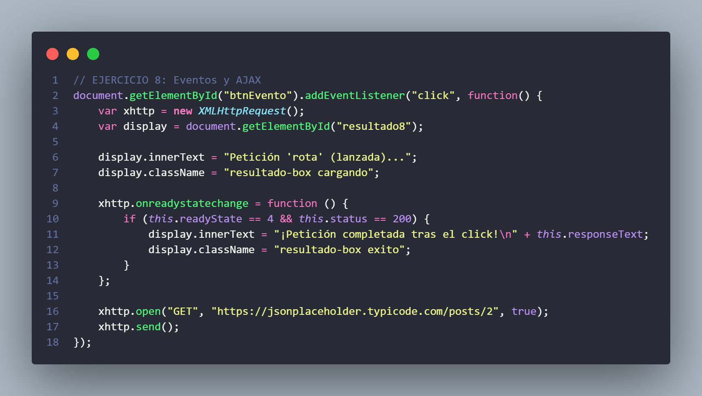
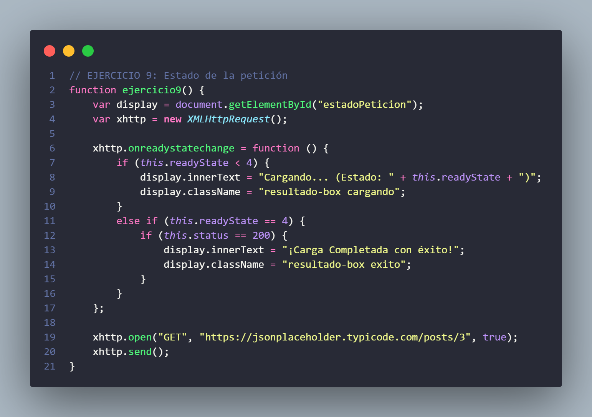
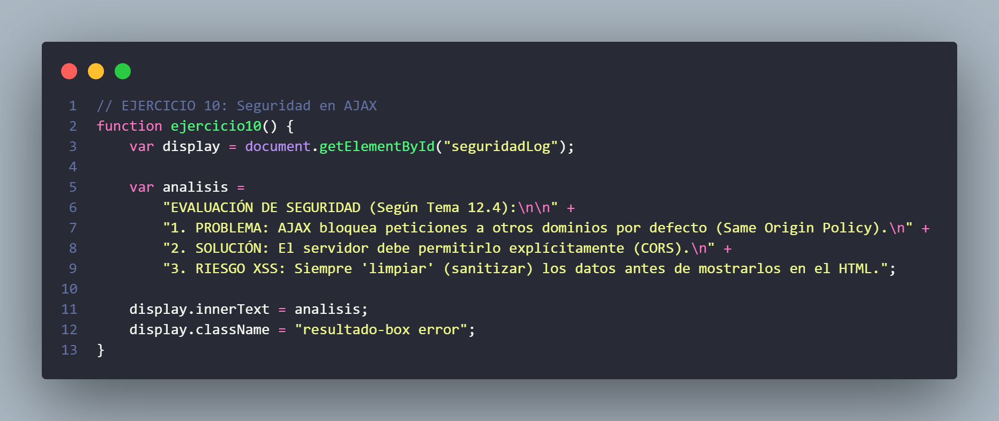

# Actividad 12: Desarrollo Asíncrono y AJAX

Este documento contiene la resolución de la **Actividad 12**, centrada en el uso de **AJAX** mediante el objeto **`XMLHttpRequest`**, tal y como se describe en el **Tema 12 del módulo Desarrollo Web en Entorno Cliente**.  
La actividad aborda peticiones **GET y POST**, manipulación del **DOM**, procesamiento de **JSON**, manejo de **eventos**, control de **estados de la petición** y nociones básicas de **seguridad en AJAX**.

---

## 1. **Petición GET con AJAX**
- Realización de una petición GET a un servidor externo sin recargar la página.

### Uso de `XMLHttpRequest` y método `open()`
Se crea un objeto `XMLHttpRequest` que permite solicitar datos al servidor de forma asíncrona y mostrar la respuesta en la consola del navegador.

#### Código:

---

## 2. **Envío de datos al servidor con POST**
- Envío de un objeto JSON utilizando el método POST.

### Método `POST` y `setRequestHeader()`
Se envían datos al servidor en formato JSON, estableciendo correctamente la cabecera `Content-Type` para indicar el tipo de contenido enviado.

#### Código:

---

## 3. **Actualización del DOM con AJAX**
- Obtención de datos desde un servidor y actualización de un elemento HTML.

### Manipulación del DOM
La respuesta recibida en formato JSON se procesa y se muestra el nombre del usuario en un elemento identificado por su `id`.

#### Código:

---

## 4. **Manejo de errores en una petición AJAX**
- Control de errores en la comunicación con el servidor.

### Control de estado y código HTTP
Se verifica el estado de la petición y el código de respuesta. Si la petición falla, se muestra un mensaje de error en la consola.

#### Código:

---

## 5. **Comparación entre GET y POST**
- Explicación teórica sobre el uso de los métodos GET y POST en AJAX.

### Diferencias principales
- **GET:** recomendado para obtener datos.
- **POST:** recomendado para enviar datos sensibles o grandes cantidades de información.

#### Ejemplo:

---

## 6. **Carga de datos asíncrona**
- Carga de información desde un servidor y actualización parcial de la página.

### Comunicación asíncrona
Se obtiene información sin bloquear la interfaz del usuario, mejorando la experiencia de uso.

#### Código:

---

## 7. **Procesamiento de respuesta en formato JSON**
- Extracción de un campo relevante de una respuesta JSON.

### Uso de `JSON.parse()`
La respuesta del servidor se convierte en un objeto JavaScript y se muestra un dato concreto en la interfaz.

#### Código:

---

## 8. **Eventos y AJAX**
- Asociación de una petición AJAX a un evento de usuario.

### Evento `click`
La petición AJAX se ejecuta al pulsar un botón, demostrando la interacción entre eventos y comunicaciones asíncronas.

#### Código:

---

## 9. **Indicador de estado de la petición**
- Visualización de un mensaje de carga mientras se procesa la petición.

### Estados de `readyState`
Se muestra el mensaje **“Cargando…”** hasta que la petición finaliza correctamente y se reciben los datos del servidor.

#### Código:

---

## 10. **Seguridad en AJAX**
- Evaluación de posibles problemas de seguridad.

### Buenas prácticas
- Uso de POST para datos sensibles.
- Control de errores.
- Evitar exponer información en la URL.
- Uso correcto de cabeceras HTTP.

#### Código:

---

## **Resumen Técnico**
La utilización de **AJAX** mediante `XMLHttpRequest` ha permitido:
- Mejorar la experiencia del usuario evitando recargas completas.
- Gestionar comunicaciones asíncronas de forma eficiente.
- Procesar datos JSON y actualizar el DOM dinámicamente.
- Aplicar control de errores y estados de la petición.

---

**Asignatura:** Desarrollo Web en Entorno Cliente  
**Curso:** 2025-2026  
**Alumno:** [Carmen Varela Iglesias](https://github.com/varelaiglesiascarmen)