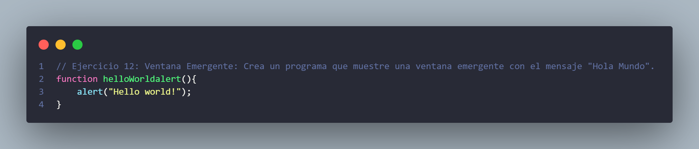

# Parte 3.2 Actividades Prácticas JavaScript

Este repositorio contiene un conjunto de **10 actividades prácticas** que refuerzan los contenidos del **Tema 3: JavaScript**: variables, tipos de datos, conversión de tipos, eventos, manipulación del DOM y limitaciones del lenguaje.

---

## Actividad 1: Declarar variables y mostrar en consola
**Descripción:**  
Declara tres variables (`nombre`, `edad` y `ciudad`) y muéstralas en la consola. Identifica el tipo de dato con `typeof`.  

**Captura de pantalla:**  

---

## Actividad 2: Concatenación de cadenas y números
**Descripción:**  
Concatena cadenas y números usando el operador `+` y template literals.  

**Captura de pantalla:**  

---

## Actividad 3: Conversión de tipos
**Descripción:**  
Declara una variable y conviértela a distintos tipos (`Number`, `String`, `Boolean`). Explica el resultado obtenido.  

**Captura de pantalla:**  

---

## Actividad 4: Variable no declarada
**Descripción:**  
Reproduce el caso práctico `Variable address` con una variable no declarada. Observa el error y corrígelo.  

**Captura de pantalla:**  

---

## Actividad 5: Formulario y validación
**Descripción:**  
Implementa un formulario sencillo (input + botón) y valida que el campo no esté vacío antes de mostrar un `alert`.  

**Captura de pantalla:**  

---

## Actividad 6: Conversión de texto a número
**Descripción:**  
Convierte datos de texto a número usando `parseInt` y `parseFloat`. Controla el caso de `NaN`.  

**Captura de pantalla:**  

---

## Actividad 7: Comentarios en JavaScript
**Descripción:**  
Crea un código con comentarios de línea y de bloque que explique el funcionamiento de un script de 5-6 líneas.  

**Captura de pantalla:**  

---

## Actividad 8: Manipulación del DOM
**Descripción:**  
Cambia el contenido y el estilo de un párrafo con JavaScript al hacer clic en un botón.  

**Captura de pantalla:**  

---

## Actividad 9: Captura de evento de teclado
**Descripción:**  
Captura un evento del teclado en un campo de texto e imprime en consola la tecla pulsada.  

**Captura de pantalla:**  

---

## Actividad 10: Limitación de JavaScript en navegador
**Descripción:**  
Reflexiona sobre una limitación de JavaScript en el navegador, por ejemplo el acceso a archivos locales, e ilústrala con un ejemplo.  

**Captura de pantalla:**  

---
# Parte 3.2 Conceptos básicos JavaScript
Para la parte 3.2 he creado main2.js y para que funcionen todas sus function he creado un window.onload para que cargen las funciones al arrancar la página

**Captura de pantalla:**  

---

## Actividad 11: Hello World
**Descripción:**  
Escribe un programa que muestre el mensaje "Hola Mundo" en la pantalla.  

**Captura de pantalla:**  

---

## Actividad 12: Ventana emergente
**Descripción:**  
Crea un programa que muestre una ventana emergente con el mensaje "Hola Mundo".  

**Captura de pantalla:**  

---

## Actividad 13: Suma Simple
**Descripción:**  
Declara dos variables, asígnales los valores 5 y 10, y muestra la suma de las variables en una ventana emergente.  

**Captura de pantalla:**  

---

## Actividad 14: Interactiva 
**Descripción:**  
Pide al usuario que introduzca dos números utilizando ventanas emergentes y muestra la suma de los dos números en una ventana emergente.

**Captura de pantalla:**  

---

## Actividad 15: Saludo Personalizado
**Descripción:**  
Pide al usuario su nombre utilizando una ventana emergente y muestra un mensaje de saludo personalizado en una ventana emergente.

**Captura de pantalla:**  

---

## Actividad 16: Cálculo en Línea
**Descripción:**  
Escribe un programa que calcule la suma de 3 + 5 y muestre el resultado directamente en la pantalla

**Captura de pantalla:**  

---

**Autor:** Carmen Varela Iglesias  
**Curso:** Desarrollo Web entorno Cliente  
**Tema:** JavaScript – Variables, Tipos de Datos y Eventos
**Actividad:** 3
