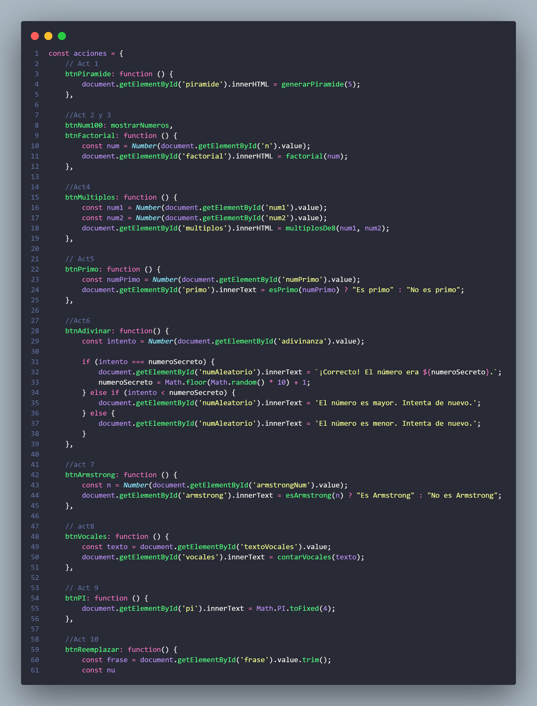
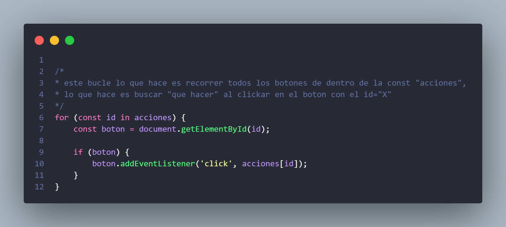
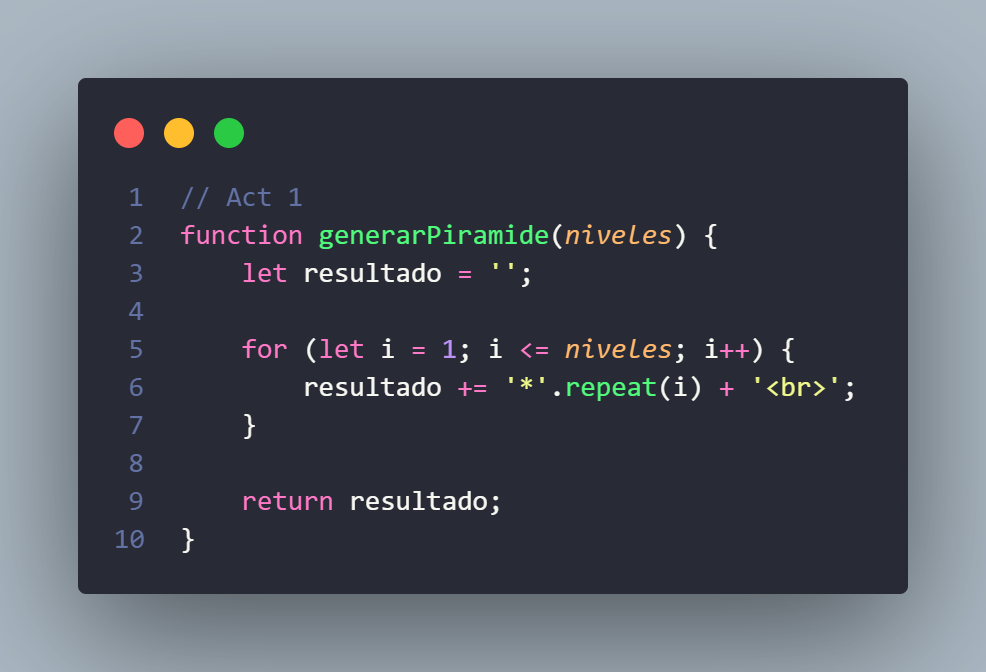
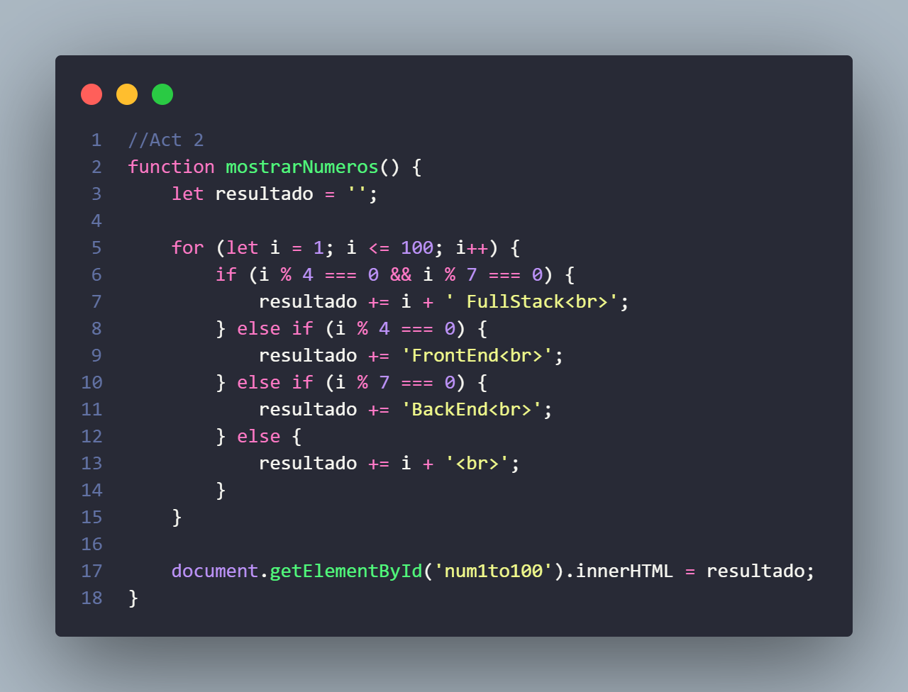
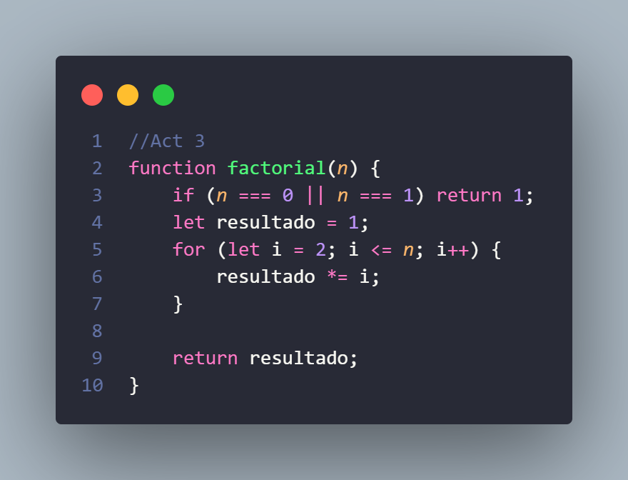
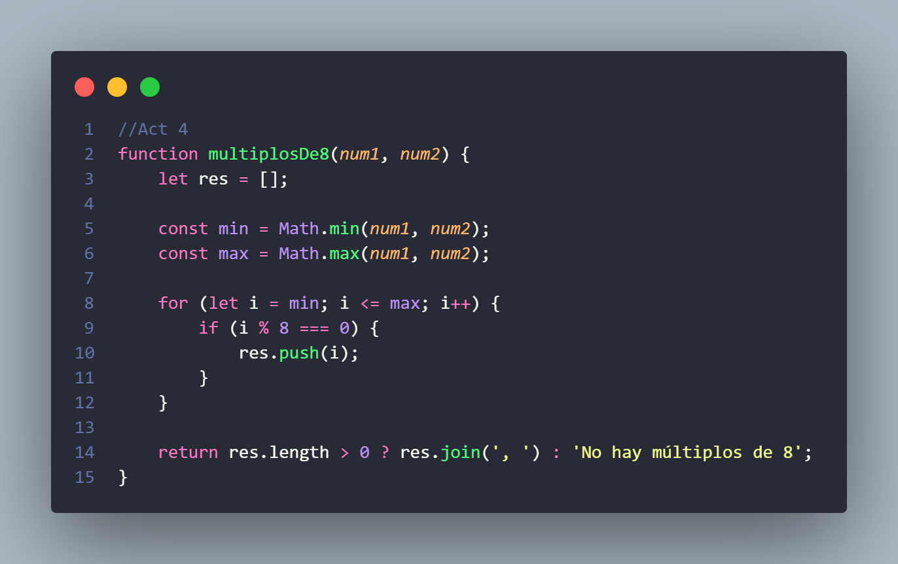
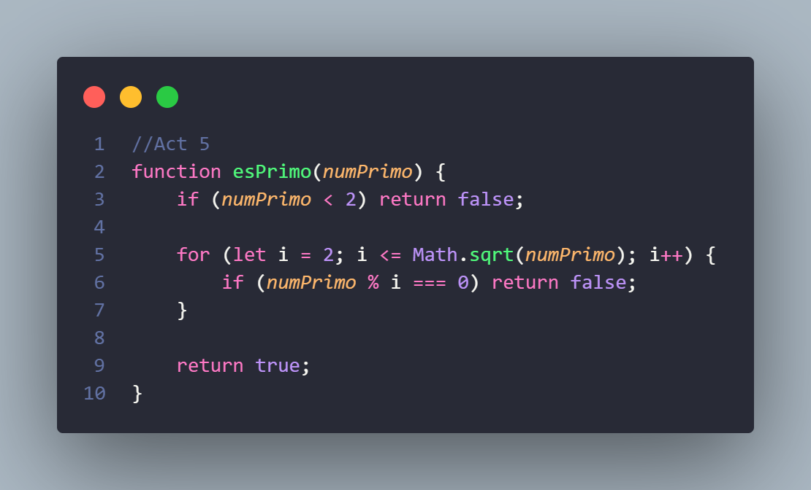
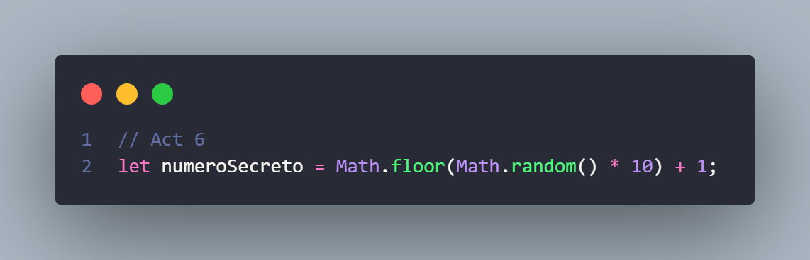
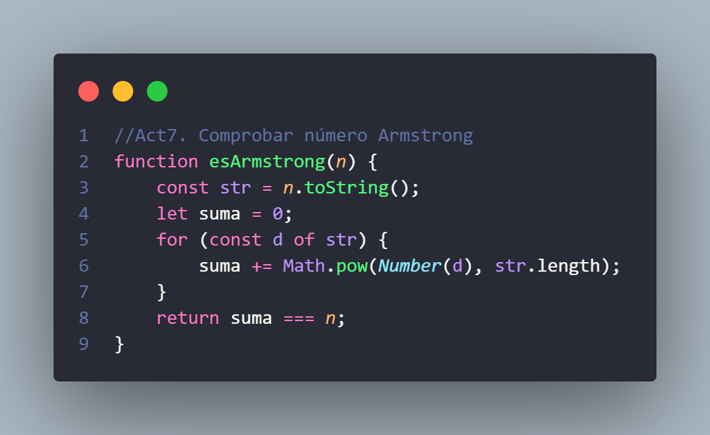

# Actividades Prácticas – Tema 4: JavaScript
Proyecto con ejercicios prácticos para aprender manipulación del DOM, funciones y lógica en JavaScript

**Aclaración:**  
Para realizar esta actividad cree una const que dentro guarda un falso array de botones que bucan la funcion que les corresponde hacer 'onClick' interpretados por un id único para cada uno de ellos

**Captura de pantalla:**  

**¿Cómo funciona?**

---

## Cómo ejecutar
1. Abrir `index.html` en un navegador moderno.
2. Hacer clic en los botones para ejecutar cada actividad.

---

## Actividad 1: Declarar variables y mostrar en consola
**Descripción:**  
Escribe un programa que genere una pirámide de asteriscos. La base de la pirámide debe tener cinco niveles 

**Captura de pantalla:**  

---

## Actividad 2: Concatenación de cadenas y números
**Descripción:**  
Crea un programa que imprima los números del 1 al 100. Para los múltiplos de 4, debe imprimir "FrontEnd" en lugar del número. Para los múltiplos de 7, debe imprimir "BackEnd". Si un número es múltiplo de ambos, debe imprimir "FullStack" junto con el número

**Captura de pantalla:**  

---

## Actividad 3: Conversión de tipos
**Descripción:**  
Desarrolla un programa que pida un número y calcule su factorial. El factorial de un número es el resultado de multiplicar ese número por todos los números enteros positivos menores que él  

**Captura de pantalla:**  

---

## Actividad 4: Variable no declarada
**Descripción:**  
Escribe un programa que solicite dos números al usuario y que imprima los múltiplos de 8 que se encuentren entre los dos números, independientemente del orden en que se ingresen  

**Captura de pantalla:**  

---

## Actividad 5: Formulario y validación
**Descripción:**  
Crea un programa que pida un número y determine si es un número primo. Un número es primo si solo es divisible por 1 y por sí mismo  

**Captura de pantalla:**  

---

## Actividad 6: Conversión de texto a número
**Descripción:**  
Desarrolla un programa que elija un número aleatorio entre 1 y 10. El usuario debe adivinar el número ingresando valores hasta acertar. El programa debe informar cuándo el número es correcto

**Captura de pantalla:**  

---

## Actividad 7: Comentarios en JavaScript
**Descripción:**  
Crea un programa que pida un número de tres dígitos y determine si es un número de Armstrong. Un número es de Armstrong si la suma de los cubos de sus dígitos es igual al número original 

**Captura de pantalla:**  

---

## Actividad 8: Manipulación del DOM
**Descripción:**  
Escribe un programa que pida una cadena de texto al usuario y cuente cuántas vocales contiene 

**Captura de pantalla:**  

---

## Actividad 9: Captura de evento de teclado
**Descripción:**  
Desarrolla un programa que imprima el valor de PI con cuatro decimales  

---

## Actividad 10: Limitación de JavaScript en navegador
**Descripción:**  
Crea un programa que pida al usuario una frase y le permita reemplazar una palabra específica por otra que elija  

---

**Autor:** Carmen Varela Iglesias  
**Tecnologías:** CodeSnap, Visual Studio y GitHub  
**Curso:** Desarrollo Web entorno Cliente  
**Actividad:** 4
