# Actividad 6: Estructura de datos. El array

## Tarea 1: Creación y acceso a arrays

### Descripción
Crea un array llamado `frutas` que contenga los siguientes elementos: `"manzana"`, `"banana"`, `"naranja"`, `"uva"`. Luego, realiza las siguientes acciones:
- Accede al primer y al último elemento del array.
- Agrega una nueva fruta al final del array.
- Muestra por consola el array completo y la longitud del array.

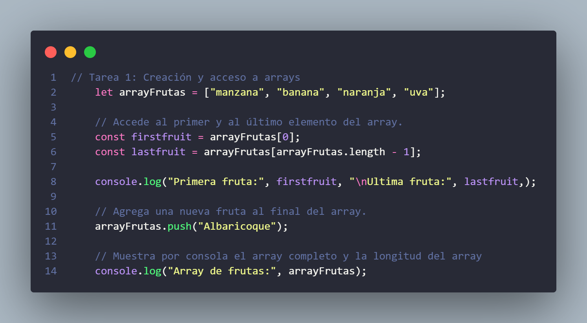

#### Objetivos
- Aprender a crear arrays.
- Practicar el acceso a los elementos mediante índices.
- Familiarizarse con el uso de los métodos `push()` y `length`.

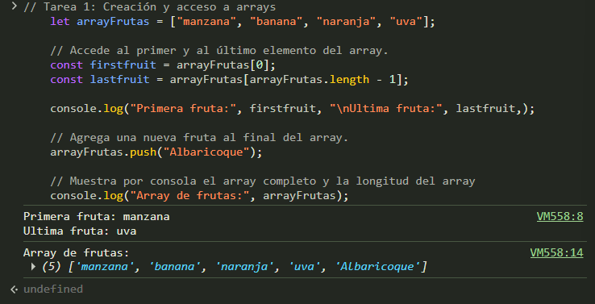
---

## Tarea 2: Modificación de propiedades de objetos

### Descripción
Crea un objeto llamado `persona` con las siguientes propiedades: `nombre`, `apellido`, `edad`, y `pais`. Después:
- Modifica el valor de la propiedad `edad`.
- Agrega una nueva propiedad llamada `profesion`.
- Elimina la propiedad `pais` del objeto.
- Muestra por consola el objeto modificado.

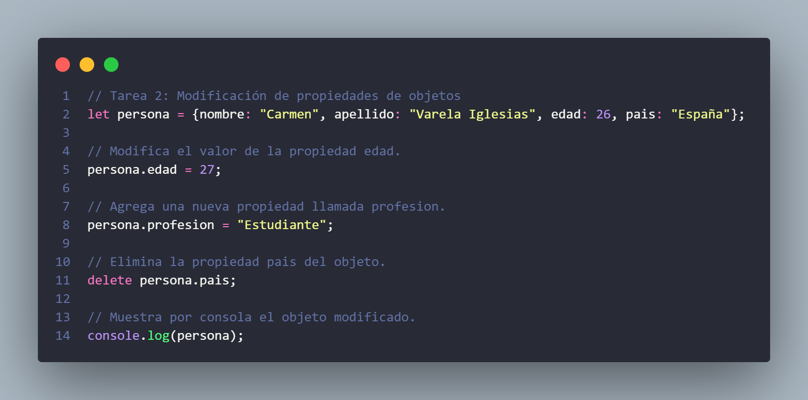

#### Objetivos
- Manipular propiedades de objetos.
- Aprender a agregar y eliminar propiedades dinámicamente.

---

## Tarea 3: Iteración sobre arrays

### Descripción
Crea un array llamado `nombres` que contenga 5 nombres de personas. Recorre el array usando un bucle `for` y otro usando el método `forEach()`, mostrando cada nombre por consola.

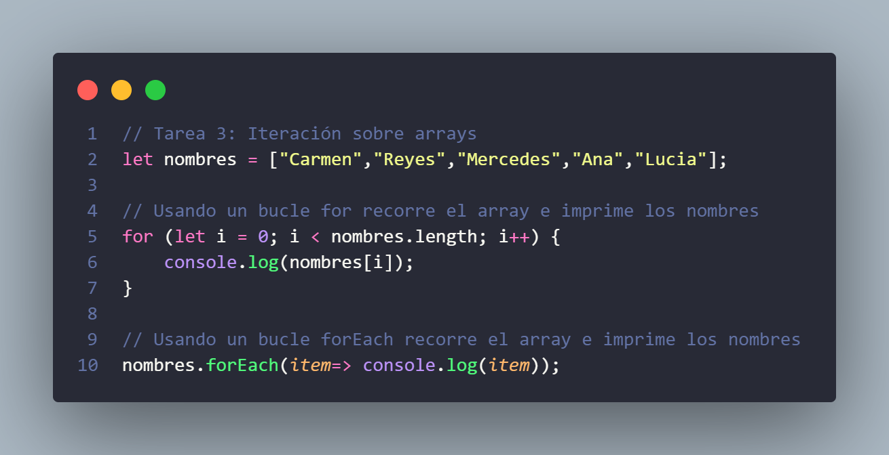

#### Objetivos
- Familiarizarse con la iteración sobre arrays usando diferentes enfoques.
- Comprender la diferencia entre el bucle `for` y el método `forEach()`.

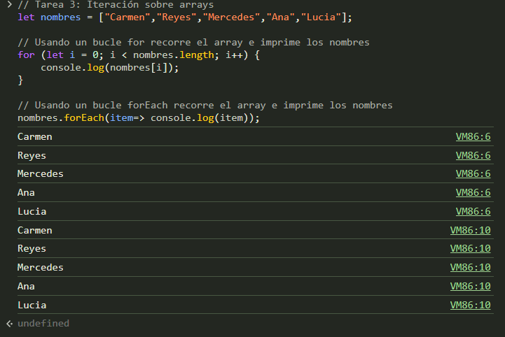
---

## Tarea 4: Ordenar y manipular arrays

### Descripción
Crea un array de números: `[5, 2, 9, 1, 7]`. Realiza las siguientes acciones:
- Ordena el array de menor a mayor usando el método `sort()`.
- Invierte el orden del array usando el método `reverse()`.
- Personaliza la función de comparación en `sort()` para ordenar los números de mayor a menor.

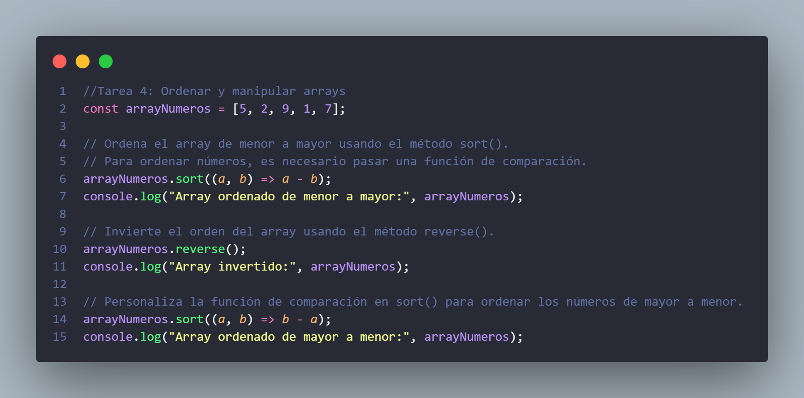

#### Objetivos
- Aprender a utilizar los métodos de ordenación y personalizar funciones de comparación.

---

## Tarea 5: Inserción y eliminación de elementos en un array

### Descripción
Crea un array de colores: `["rojo", "verde", "azul", "amarillo"]`. Realiza las siguientes acciones:
- Añade `"naranja"` al principio del array.
- Elimina el último color del array.
- Utiliza `splice()` para eliminar el segundo color y añadir `"morado"` en su lugar.
- Muestra el array resultante por consola.

#### Objetivos
- Practicar la inserción y eliminación de elementos en un array usando métodos como `splice()`, `push()`, y `shift()`.

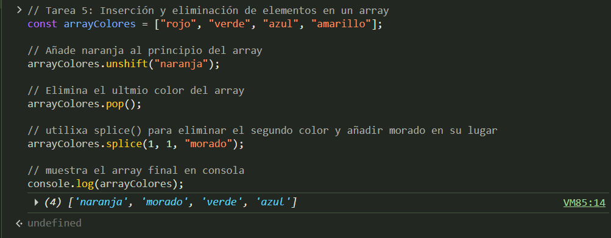
---

## Tarea 6: Combinar y dividir arrays

### Descripción
Crea dos arrays: `array1 = ["A", "B", "C"]` y `array2 = ["D", "E", "F"]`. Luego:
- Combina ambos arrays en uno nuevo llamado `array3` usando `concat()`.
- Usa el método `slice()` para extraer una porción de `array3` que incluya los primeros 4 elementos.
- Muestra los arrays combinados y la porción extraída.

#### Objetivos
- Aprender a combinar y dividir arrays.
- Practicar con métodos como `concat()` y `slice()`.

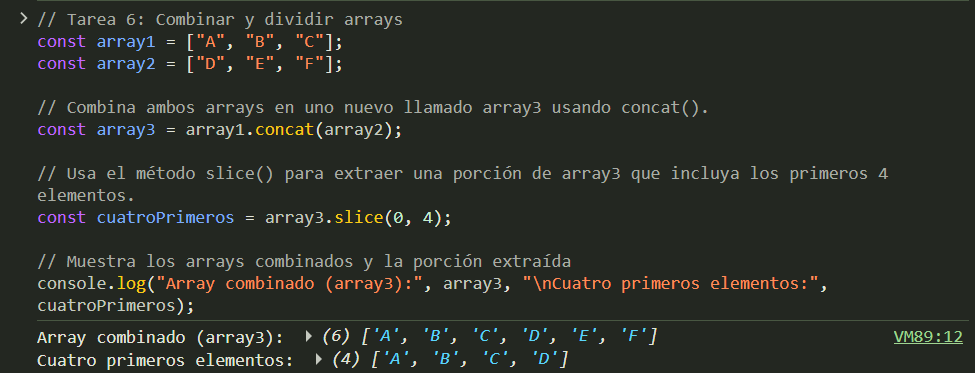
---

## Tarea 7: Caso práctico de objetos y arrays

### Descripción
Crea una lista de objetos llamada `empleados`, donde cada objeto represente a un empleado con las propiedades `nombre`, `edad`, y `salario`. Realiza las siguientes acciones:
- Añade 3 empleados al array.
- Ordena los empleados por su `salario` de menor a mayor.
- Filtra el array para mostrar solo los empleados mayores de 30 años.
- Muestra los resultados por consola.

#### Objetivos
- Combinar arrays y objetos.
- Practicar operaciones avanzadas como la ordenación y el filtrado de datos.

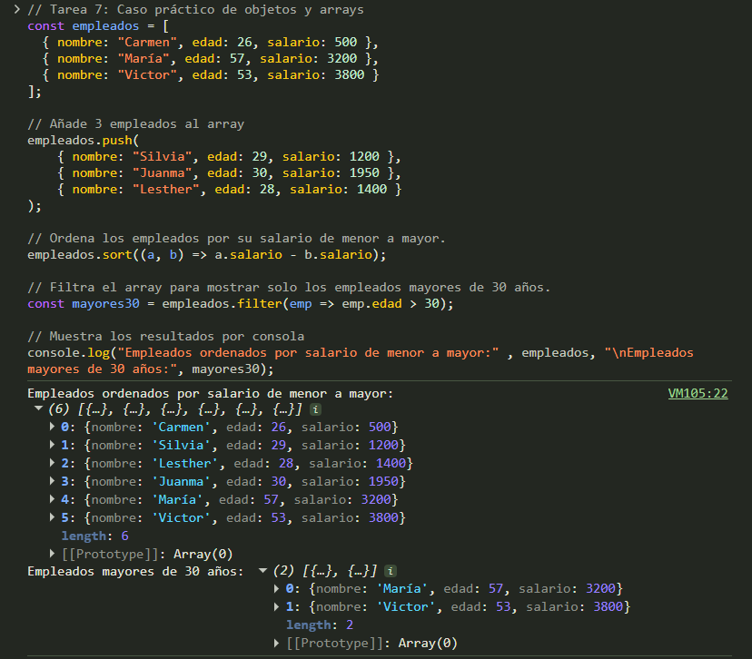
---

## Tarea 8: Búsqueda de elementos en un array

### Descripción
Crea un array llamado `ciudades` que contenga los nombres de 6 ciudades. Luego:
- Busca si `"Madrid"` está presente en el array utilizando el método `includes()`.
- Encuentra la posición de `"Barcelona"` usando el método `indexOf()`.
- Si la ciudad no está en el array, agrega una nueva ciudad al final.

#### Objetivos
- Practicar la búsqueda de elementos en un array.
- Manipular arrays según condiciones específicas (agregar elementos si no existen).

---

## Tarea 9: Filtrar un array de objetos

### Descripción
Crea un array de objetos llamado `productos`, donde cada objeto tenga las propiedades `nombre`, `categoria`, y `precio`. Luego:
- Filtra el array para obtener solo los productos de la categoría `"tecnología"`.
- Filtra los productos cuyo `precio` sea mayor a 100.
- Muestra los resultados por consola.

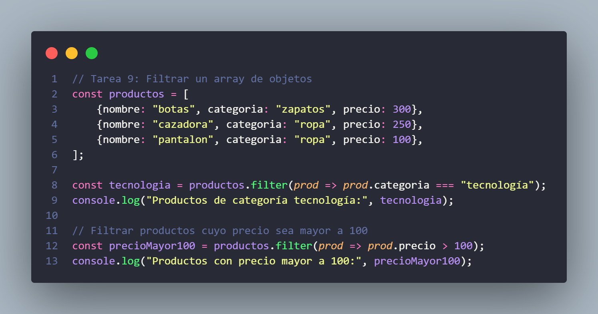

#### Objetivos
- Practicar el uso del método `filter()` para obtener subconjuntos de un array de objetos.

---

## Tarea 10: Reducir un array de números

### Descripción
Crea un array de números llamado `ventas`: `[100, 200, 300, 400, 500]`. Luego:
- Utiliza el método `reduce()` para sumar todas las ventas.
- Calcula el promedio de las ventas sumadas.

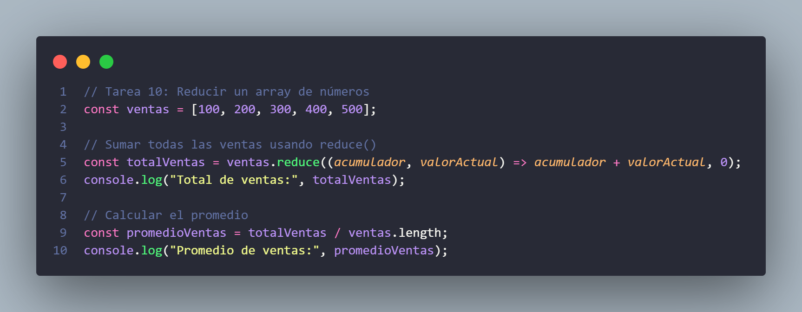

#### Objetivos
- Aprender a utilizar el método `reduce()` para realizar cálculos agregados sobre arrays.
- Practicar operaciones matemáticas básicas con los resultados obtenidos.

