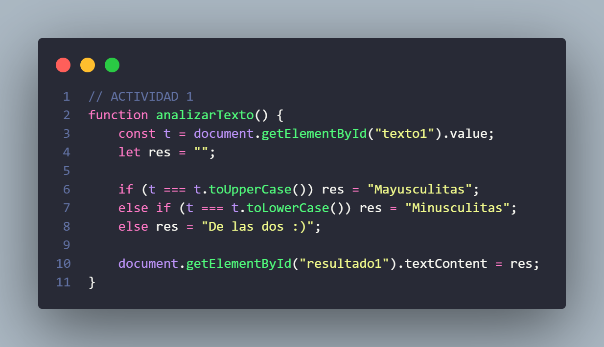
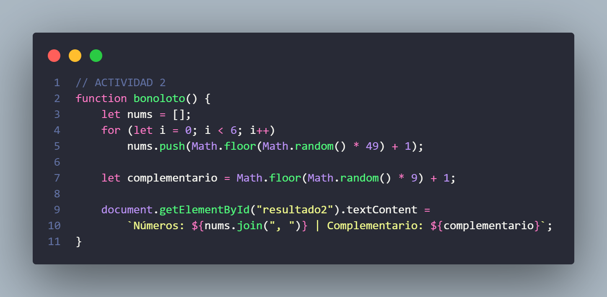
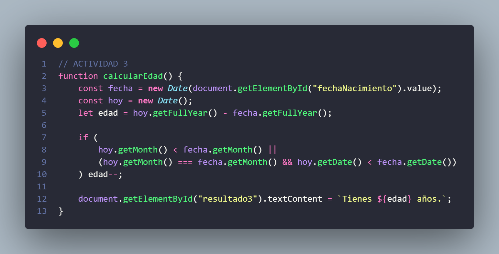
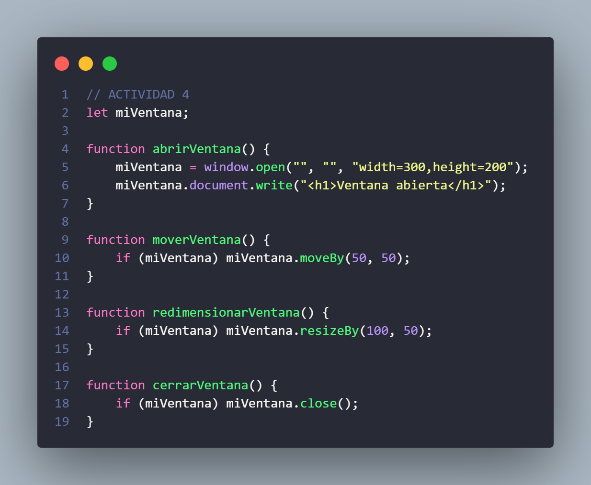
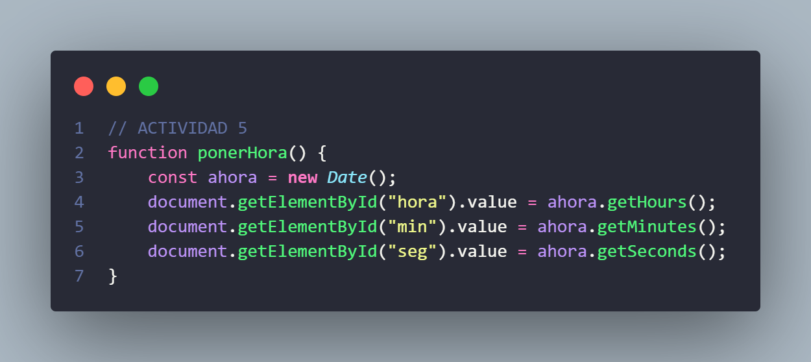
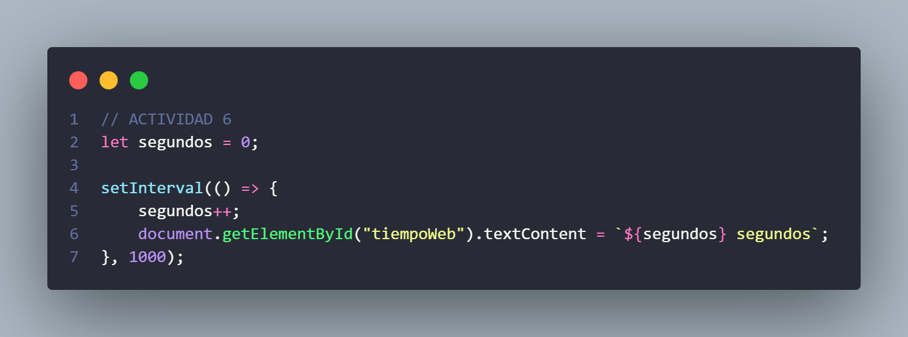
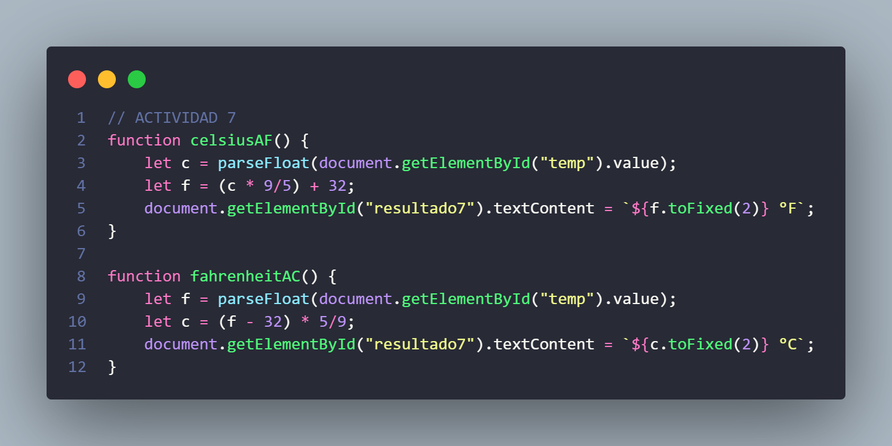
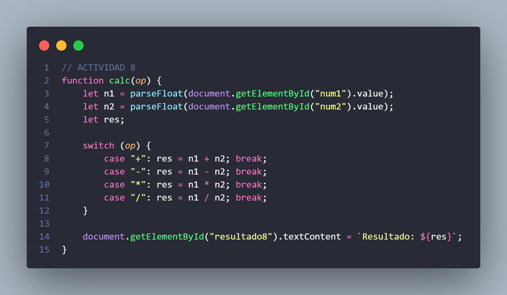
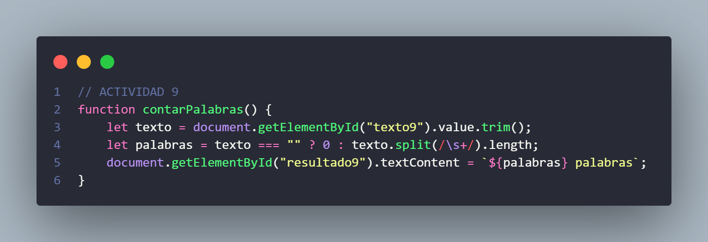

# Ejercicios DWEC – JavaScript Básico

Este repositorio contiene varias actividades destinadas a practicar JavaScript aplicado al desarrollo web. Cada ejercicio incluye un archivo HTML asociado y su correspondiente script.

---

## Actividad 1: Análisis de Minúsculas y Mayúsculas
**Archivo:** `DWEC_Ejer01_minMay.html`  
**Descripción:**  
Función que analiza una cadena de texto e identifica si está compuesta solo por minúsculas, solo por mayúsculas o una mezcla de ambas.

**Objetivos:**
- Practicar métodos del objeto `String`.
- Aplicar sintaxis básica de JavaScript.

---

## Actividad 2: Simulación de la Bonoloto
**Archivo:** `DWEC_Ejer02_numeroBonoloto.html`  
**Descripción:**  
Genera seis números aleatorios entre 1 y 49 y un complementario entre 1 y 9 usando el objeto `Math`.

**Objetivos:**
- Generación de números aleatorios.
- Uso de métodos predefinidos de JavaScript.

---

## Actividad 3: Cálculo de Edad
**Archivo:** `DWEC_Ejer03_objetoEdad.html`  
**Descripción:**  
Solicita la fecha de nacimiento y calcula la edad actual del usuario.

**Objetivos:**
- Trabajar con el objeto `Date`.
- Manipulación de fechas y cálculo de diferencias.

---

## Actividad 4: Manipulación del Objeto Window
**Archivo:** `DWEC_Ejer04_objetoVentana.html`  
**Descripción:**  
Abre una nueva ventana, muestra un mensaje, permite moverla, redimensionarla y cerrarla.

**Objetivos:**
- Explorar el objeto `window`.
- Control de ventanas emergentes.

---

## Actividad 5: Visualización de la Hora Actual
**Archivo:** `DWEC_Ejer05_ObtenerHora.html`  
**Descripción:**  
Muestra tres inputs (hora, minutos, segundos). Un botón actualiza estos valores con la hora actual.

**Objetivos:**
- Usar propiedades del objeto `Date`.
- Manipulación del DOM.

---

## Actividad 6: Temporizador de Permanencia
**Archivo:** `DWEC_Ejer06_tempoPerWeb.html`  
**Descripción:**  
Temporizador que muestra el tiempo que el usuario lleva en la web, actualizándose cada segundo.

**Objetivos:**
- Uso de `setInterval`.
- Manipulación del DOM en tiempo real.

---

## Actividad 7: Convertidor de Temperatura
**Archivo:** `DWEC_Ejer07_conTem.html`  
**Descripción:**  
Convierte temperaturas entre Celsius ↔ Fahrenheit mediante botones y un input.

**Objetivos:**
- Uso de operadores y funciones.
- Gestión de eventos y actualización del DOM.

---

## Actividad 8: Calculadora Básica
**Archivo:** `DWEC_Ejer08_calBasica.html`  
**Descripción:**  
Calculadora que realiza suma, resta, multiplicación y división entre dos números ingresados.

**Objetivos:**
- Operadores matemáticos.
- Eventos y funciones en JavaScript.

---

## Actividad 9: Contador de Palabras
**Archivo:** `DWEC_Ejer09_contPalabras.html`  
**Descripción:**  
Cuenta palabras en tiempo real conforme el usuario escribe.

**Objetivos:**
- Uso de eventos del DOM.
- Métodos del objeto `String`.

