# Actividades: Formularios y Eventos en JavaScript

Este proyecto contiene ejercicios prácticos para aprender a manejar formularios y eventos en JavaScript. Cada actividad tiene como objetivo practicar validaciones, manipulación de campos y manejo de eventos en tiempo real.

---

Inicio el script **obteniendo todos los elementos esenciales del formulario**. De esta manera, cuando se ejecuta el evento onsubmit o oninput, el script no pierde tiempo buscando los campos; ya tiene las referencias listas para manipular sus valores o sus estilos.

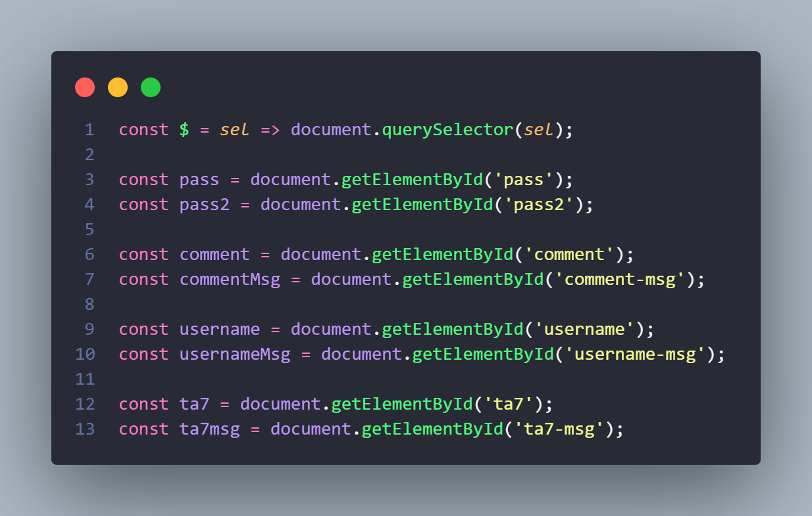

### Actividades sobre Formularios

1. **Validación de un campo de correo electrónico**
   - Se crea un formulario con un campo `<input>` para que el usuario introduzca su correo.
   - Se valida que el formato del correo sea correcto al hacer clic en el botón **Enviar**.
   - Si el formato es incorrecto, se muestra un mensaje de error.

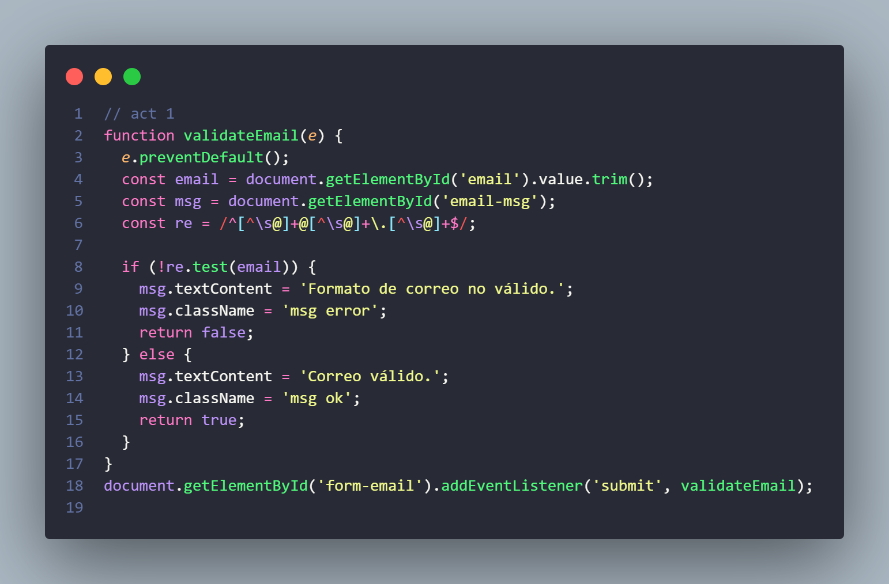

2. **Comprobación de campos obligatorios**
   - Formulario con tres campos: nombre, apellidos y teléfono.
   - Se asegura que todos los campos sean obligatorios antes de enviar.
   - Si algún campo está vacío, se muestra un mensaje de alerta.

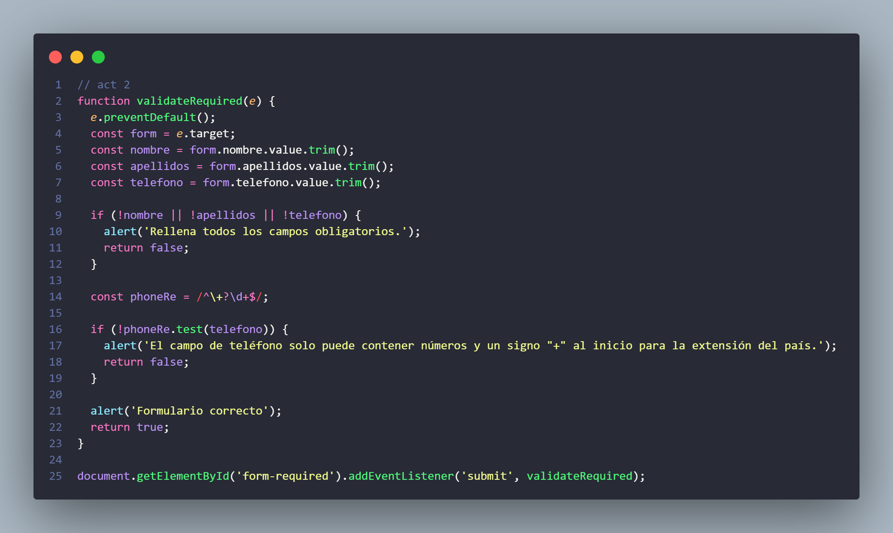

3. **Mostrar y ocultar contraseñas**
   - Formulario de registro con campo de contraseña y confirmación.
   - Botón o checkbox para mostrar u ocultar las contraseñas usando JavaScript.

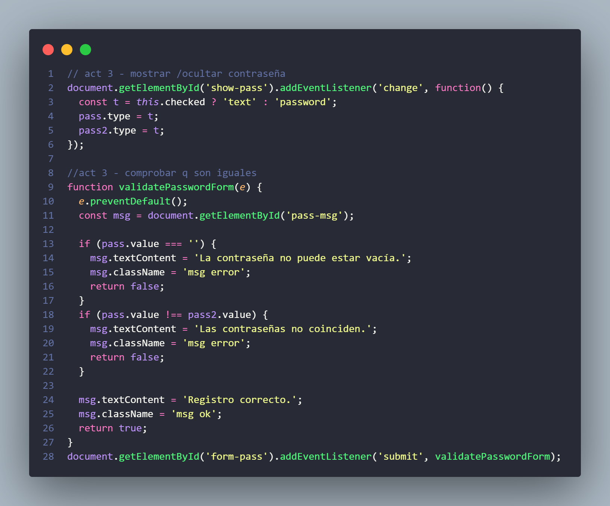

4. **Validación de longitud de texto**
   - Formulario con un campo para comentarios.
   - Se valida que el comentario tenga al menos 50 caracteres.
   - Se muestra un mensaje indicando cuántos caracteres faltan si no se cumple la longitud mínima.

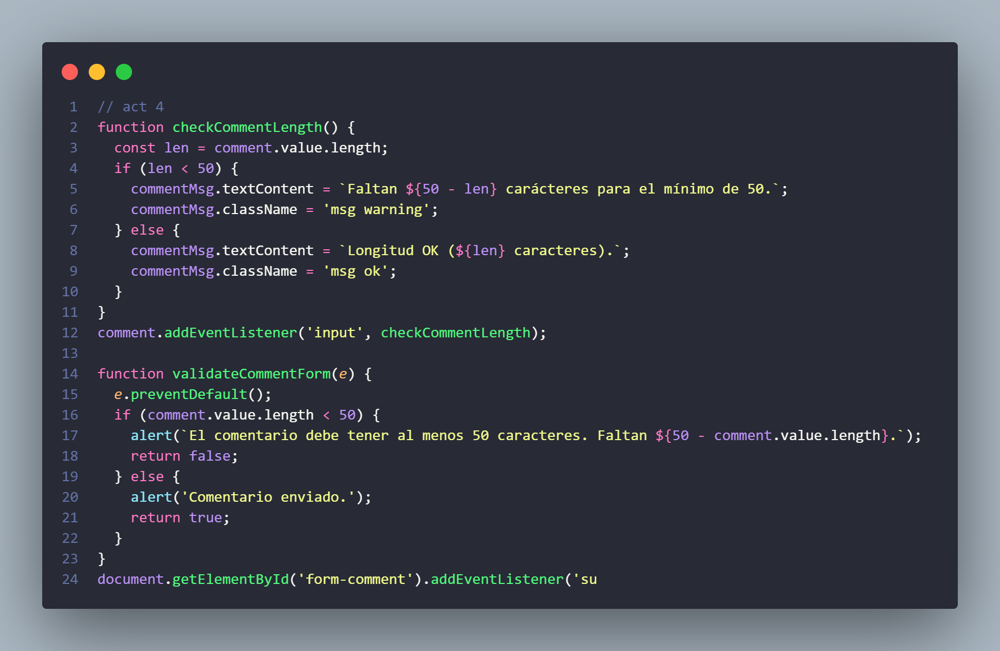

5. **Validación con expresiones regulares**
   - Formulario para introducir un nombre de usuario.
   - Solo se permiten letras y números (sin espacios ni caracteres especiales).
   - Mensaje de error si el nombre no es válido.

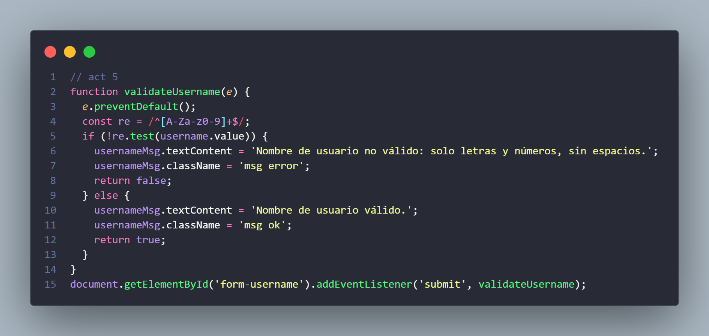

---

### Actividades sobre Eventos

6. **Detectar cambios en un campo `<input>`**
   - Campo de texto que utiliza el evento `onchange`.
   - Muestra un mensaje cada vez que el usuario cambia el valor del campo.

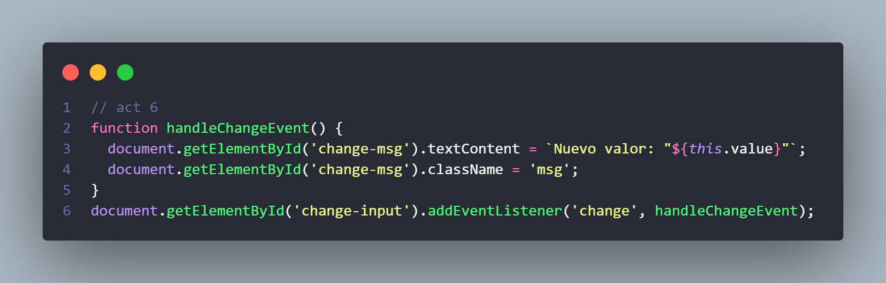

7. **Contador de caracteres en un `<textarea>`**
   - Campo `<textarea>` con evento `oninput`.
   - Muestra en tiempo real la cantidad de caracteres escritos.
   - Mensaje de advertencia si se supera el límite de 200 caracteres.

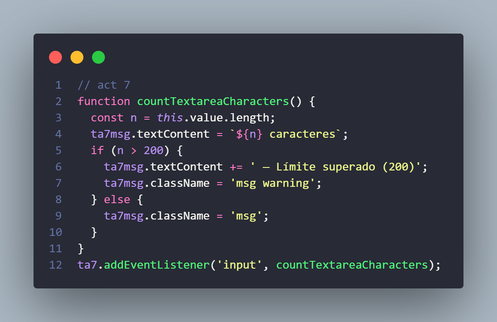

8. **Prevención del envío del formulario**
   - Formulario con campo de entrada y botón de envío.
   - Evento `onsubmit` previene el envío si el campo está vacío.
   - Se utiliza `event.preventDefault()` y se muestra un mensaje de error.

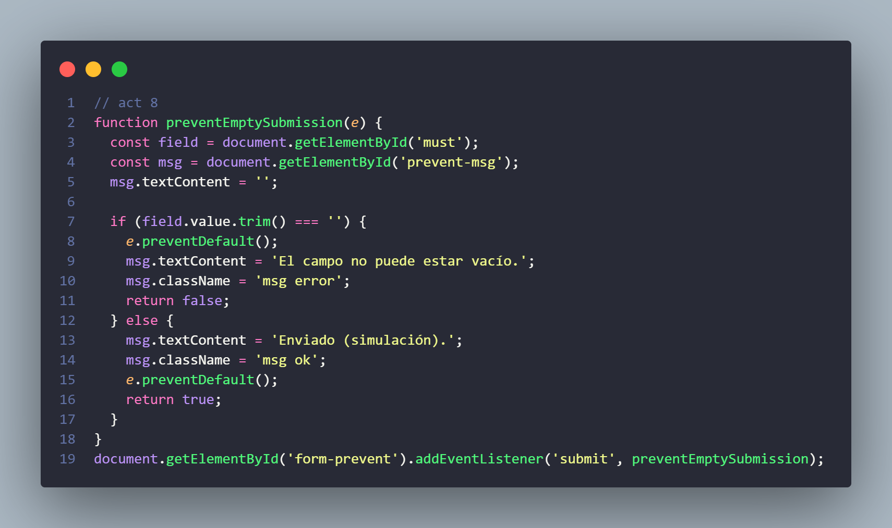

9. **Restablecer formulario al hacer clic en un botón**
   - Formulario con varios campos y botón **Reset** (`type="reset"`).
   - Evento `onreset` muestra un mensaje de confirmación antes de restablecer.
   - Si el usuario no confirma, se cancela el restablecimiento.

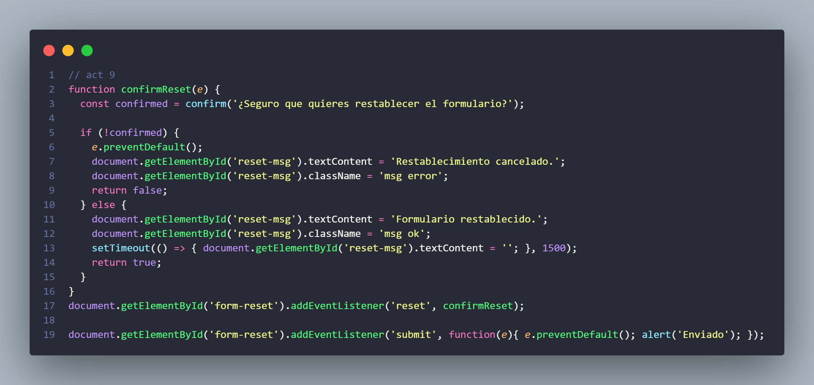

10. **Cambiar el fondo de un campo al enfocarse**
    - Formulario con varios campos de texto.
    - Evento `onfocus` cambia el color de fondo al seleccionar un campo.
    - Evento `onblur` devuelve el color original al perder el foco.

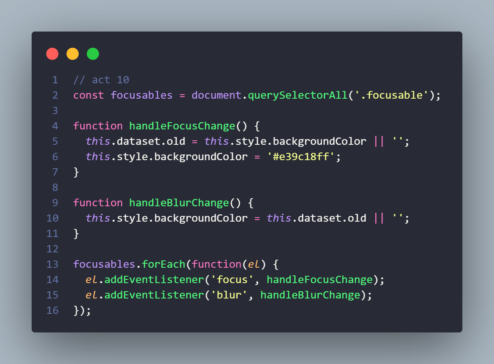