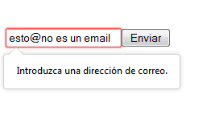
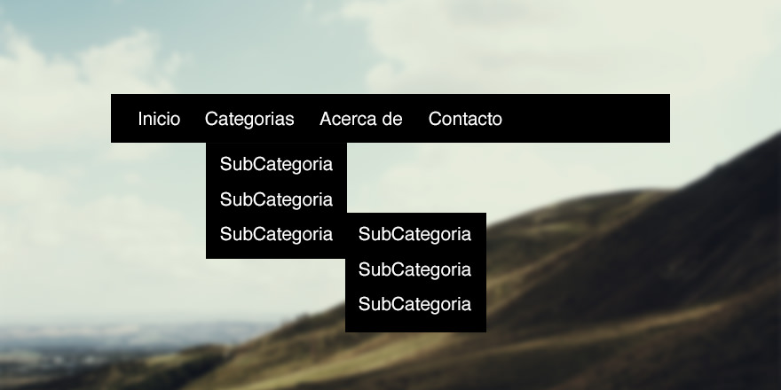
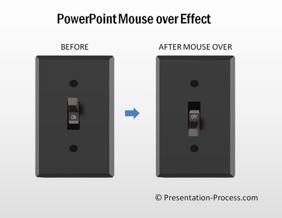
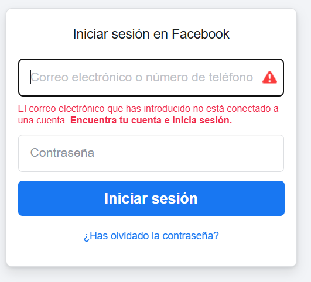
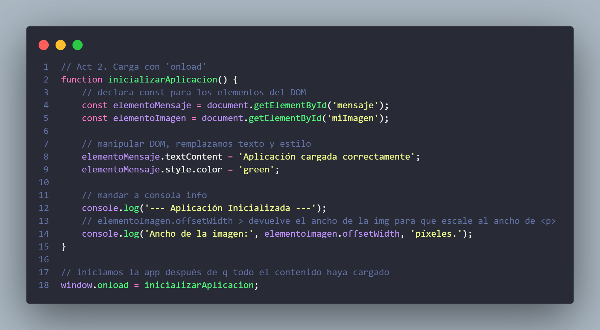
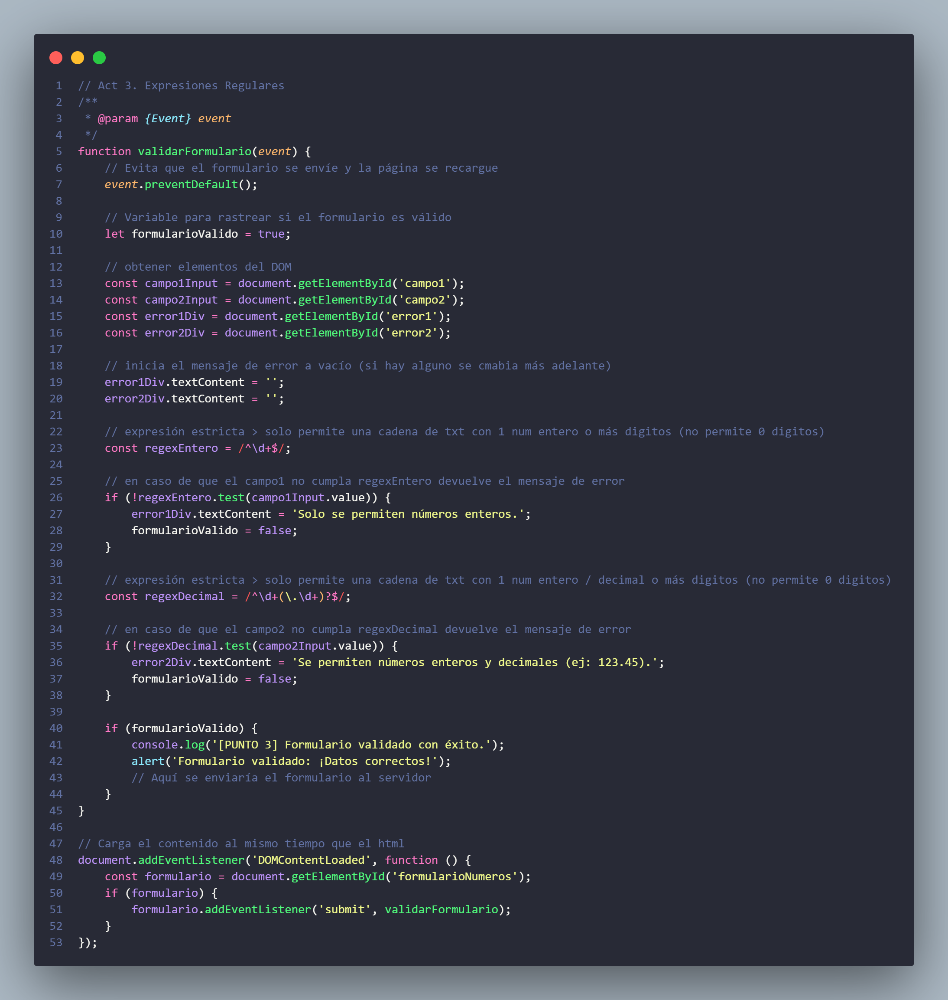
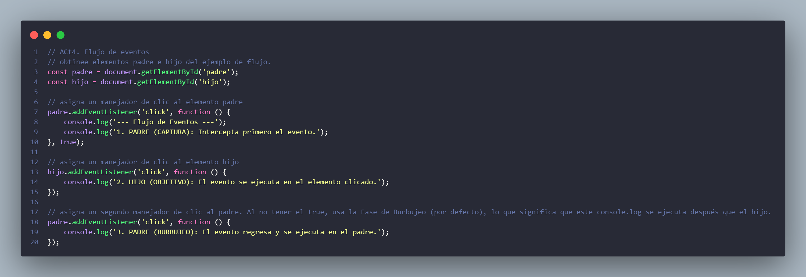
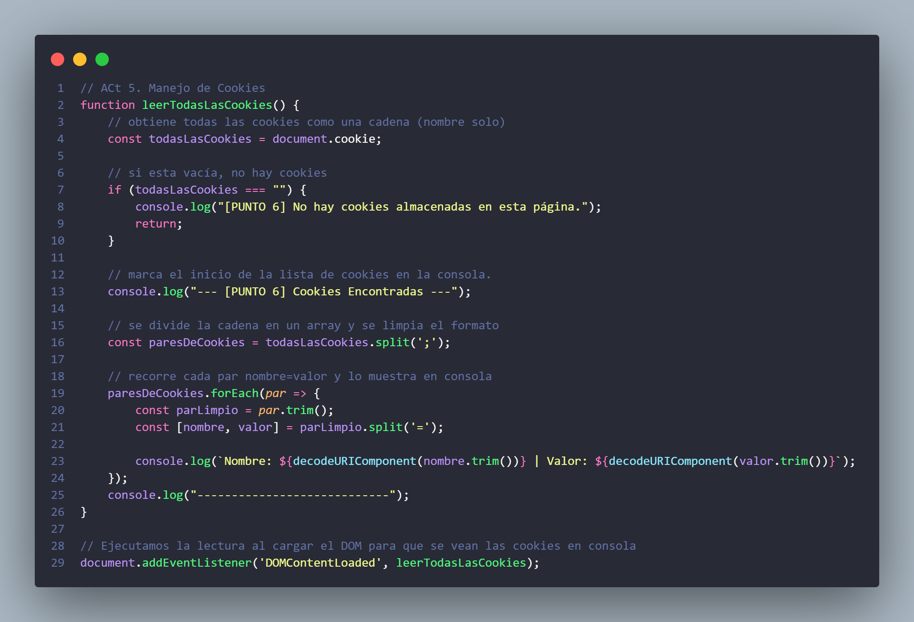
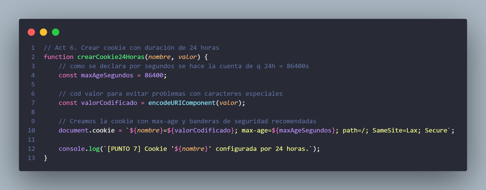
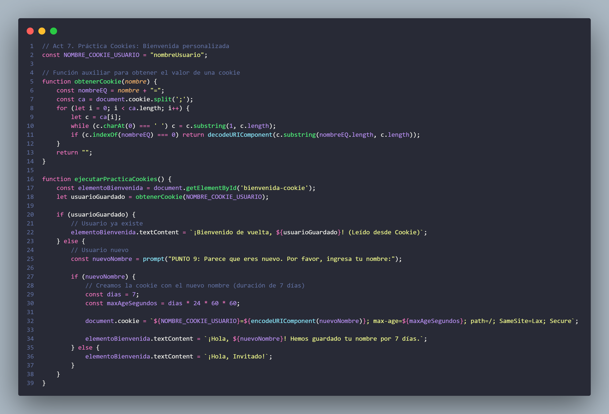

# Actividad 9: Eventos, Expresiones Regulares y Cookies

Este documento contiene las instrucciones de la **Actividad 9**, enfocada en el manejo de eventos del DOM, validación con expresiones regulares y uso de cookies en JavaScript.

---

## 1. **Eventos del DOM**
- Identifica **cinco eventos del DOM** y explica en qué casos se utilizan.

### Eventos de **click**
Se ejecuta siempre que el cliente hace click en cualquier elemento html que tenga onclik="x" haciendo que haga algo.

Su uso es esencial para la interactividad

#### Ejemplos:
- Enviar formularios al hacer click en submint

- Mostrar / ocultar menús desplegables

- Activar `lightboxes` 

### Eventos de **mouseover**
Este evento relaciona la movilidad del ratón con el comportamiento que produce en él, dependiendo del código cogerá un comportamiento u otro.

Se ejecuta cuando el `puntero del ratón pasa por encima del elemento` al que está indexado.

#### Ejemplos:
- Cambiar el color o estilo de un elemento, `se asemeja al efecto :hover de CSS`

- Mostrar una pequeña descripción de un elemento, como si fuese un `pie de página de una foto flotante en un bocadillo de cómic`

### Eventos de **submit**
Este evento se usa para el manejo de datos en formularios. Se dispara al enviar un formulario (click o enter en el formulario)

#### Ejemplos:
- Validar que todos los campos requeridos se hayan completado correctamente antes de permitir el envío.

- Enviar los datos del formulario a una API sin recargar la página.

### Eventos de **load**
El evento define el ciclo de vida de X recursos.

Se dispara cuando un objetos / recurso ha dejado de usarse (windows, img, script o link son los más comunes)

#### Ejemplos:
- Ejecutar código para inicializar una biblioteca de JavaScript después de que la página y todos sus recursos (imágenes, hojas de estilo) se hayan cargado.

- Ajustar el diseño o el tamaño de los elementos después de que una imagen grande ha terminado de cargarse.

### Eventos de **keydown**
Controla el manejo de entradas de teclado.

Se dispara cuando el user presiona una tecla y se repite hasta que deje de presionar.

- Implementar atajos de teclado (por ejemplo, presionar Ctrl + S para guardar).

- Crear juegos donde el personaje se mueve o realiza acciones cuando se pulsan ciertas teclas (como las flechas).

- Limitar o dar formato a la entrada de un campo de texto mientras el usuario escribe.
---

## 2. **Evento `onload`**
- Crea un **fragmento de código** en el que utilices el evento `onload` para cargar una función.

---

## 3. **Validación con Expresiones Regulares**
- Diseña un **formulario HTML con dos campos**.
- Utiliza **JavaScript** para validar que solo acepten números mediante **expresiones regulares**.

---

## 4. **Flujo de eventos**
- Explica el **flujo de eventos** (captura y burbujeo).
El flujo de eventos es el camino que sigue un evento a través del DOM.

- Captura (De arriba abajo): El evento viaja desde la ventana hasta el elemento objetivo.

- Objetivo (Llegada): El evento alcanza el elemento que fue activado.

- Burbujeo (De abajo arriba): El evento asciende de vuelta a través de los ancestros hasta la ventana (comportamiento por defecto).

- Crea un **ejemplo** donde un elemento padre y un hijo reciban un evento de clic.

---

## 5. **Validación de correo electrónico**
- Escribe una **expresión regular** que valide un correo electrónico.
- Explica **qué partes la componen**.

---

## 6. **Lectura de cookies**
- Crea un script en JavaScript que **lea todas las cookies de la página** e imprima sus valores en consola.

---

## 7. **Cookie de 24 horas**
- Diseña una cookie con **duración de 24 horas** y escribe el código para almacenarla.

---

## 8. **Limitaciones de las cookies**
- Explica las **limitaciones de las cookies** mencionadas en el documento y da **ejemplos**.

### 1. Limitación de Tamaño y Cantidad
Tamaño Máximo: Una cookie individual solo puede almacenar aproximadamente 4 KB de datos.

#### Ejemplo 
Si un desarrollador intenta guardar los datos detallados de una lista de deseos con 50 artículos dentro de una sola cookie, se excederá el límite de 4 KB y los datos se perderán o no se guardarán.

- Límite por Dominio: Los navegadores solo permiten un número limitado de cookies por dominio (generalmente entre 20 y 50).

#### Ejemplo 
Un sitio web de analíticas que crea una cookie nueva por cada sesión de usuario podría agotar rápidamente el límite. Cuando se alcanza el máximo, el navegador comienza a eliminar automáticamente las cookies más antiguas, lo que lleva a la pérdida de información crítica o de sesión.

### 2. Sobrecarga de Rendimiento
Envío en Cada Petición: Las cookies se envían automáticamente al servidor en la cabecera HTTP de cada solicitud HTTP (incluyendo peticiones de imágenes, archivos CSS, JavaScript, etc.) dirigida al mismo dominio.

#### Ejemplo 
Si tu sitio web carga 50 imágenes y tienes 20 cookies de 4 KB cada una (80 KB en total), esos 80 KB se envían con cada una de las 50 peticiones. Esto resulta en una sobrecarga de datos innecesaria que ralentiza la carga de la página.

### 3. Riesgos de Seguridad (Especialmente XSS)
Acceso por JavaScript: Por defecto, las cookies son accesibles mediante document.cookie a través de JavaScript.

#### Ejemplo 
En un ataque de Cross-Site Scripting (XSS), un atacante inyecta un script malicioso en tu página. Este script puede leer el document.cookie y robar la información sensible (como un ID de sesión no protegido), permitiendo la suplantación de identidad del usuario. (La solución moderna es usar la bandera HttpOnly para mitigar este riesgo).

### 4. Falta de Control de Privacidad
Cookies de Terceros: Tradicionalmente, las cookies podían ser establecidas por servidores de dominios diferentes al sitio web visitado (cookies de terceros).

#### Ejemplo 
Una red publicitaria usa una cookie de terceros para seguir tu actividad a través de múltiples sitios web. Esta es una limitación en términos de privacidad y es la razón por la que los navegadores modernos están eliminando gradualmente las cookies de terceros.

---

## 9. **Cookie con nombre del usuario**
- Crea una pequeña práctica donde se **almacene el nombre del usuario en una cookie** y se muestre en pantalla al recargar la página.

En el codigo 7 se aplica esta funcionalidad.

---

## 10. **Caso práctico de tokens**
- Analiza el caso práctico del uso de **tokens** y explica **por qué no es seguro almacenarlos en cookies**.
