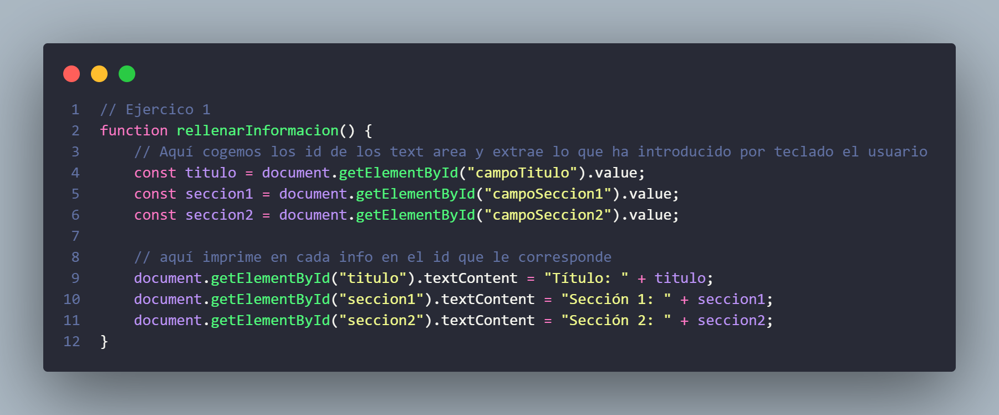
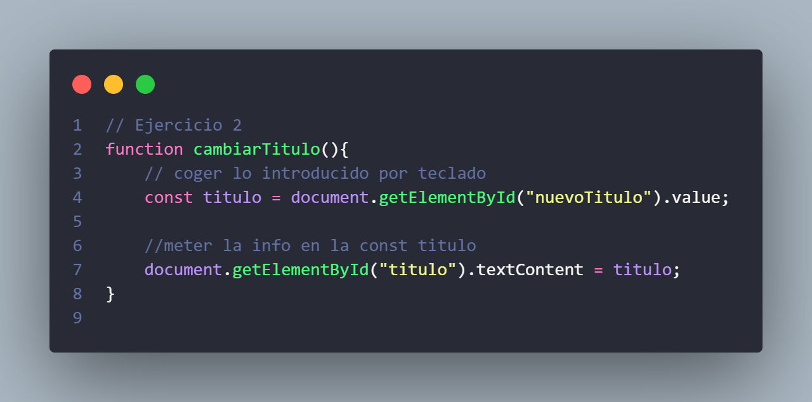
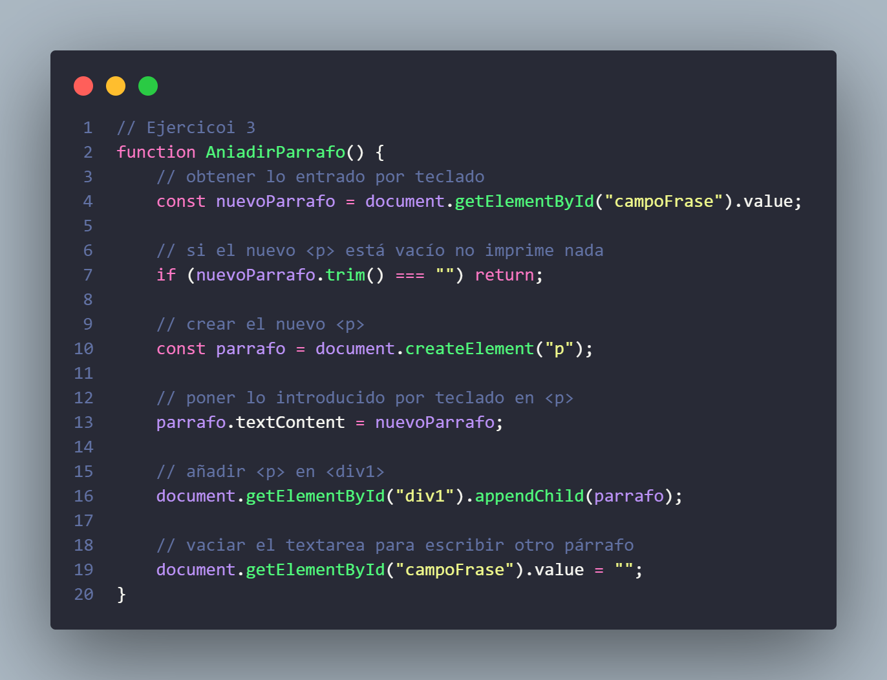
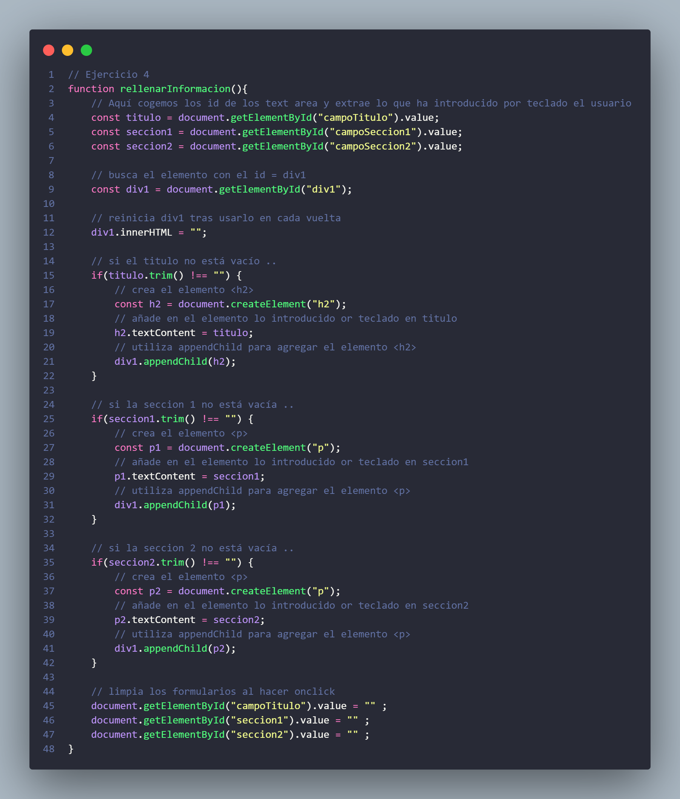
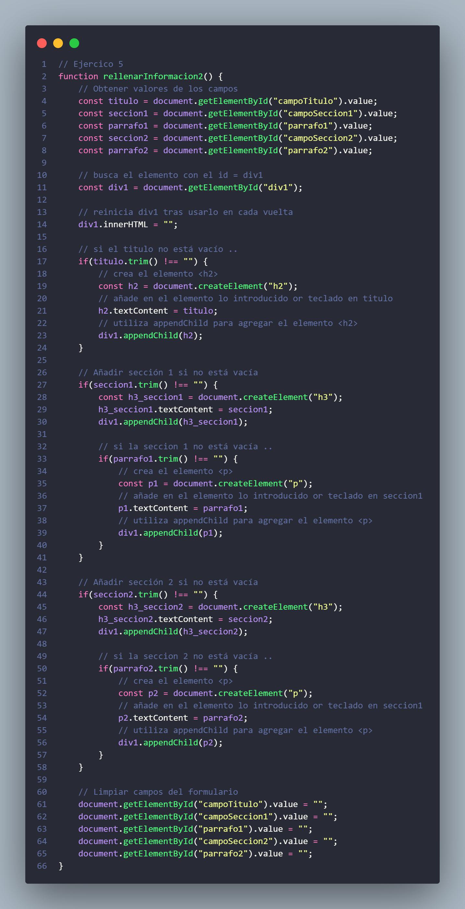
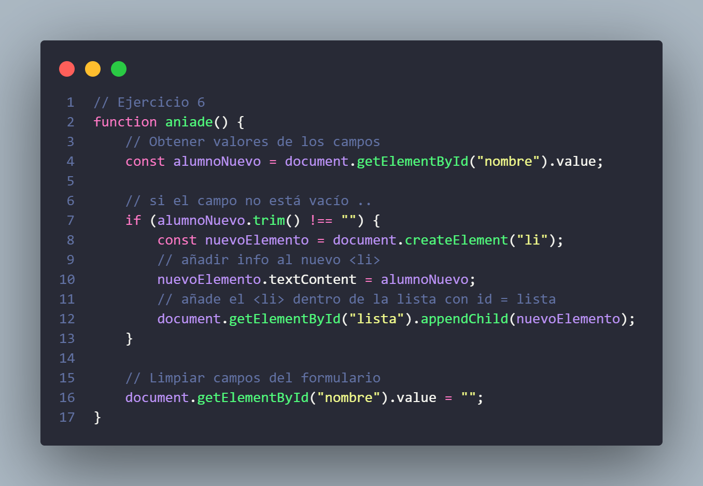
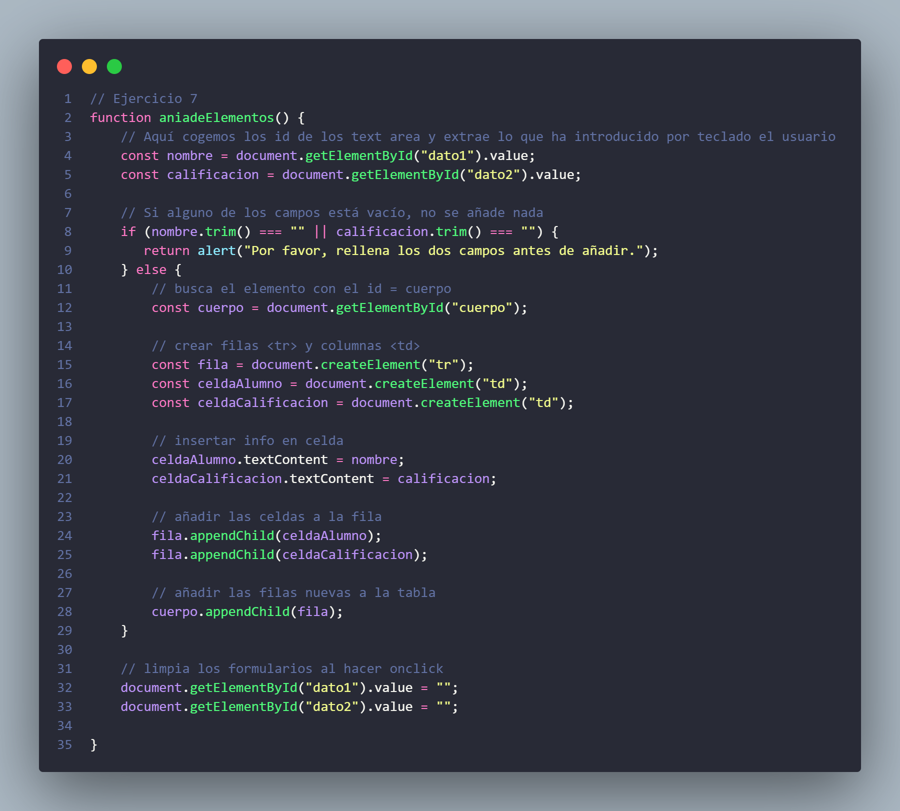

# Actividad 5: Primera relación con DOM

## Ejercicio 1
Añadir contenido al título y a dos secciones

--

## Ejercicio 2
En este ejercicio tienes que cambiar el título de una página web.

--

## Ejercico 3
En esta actividad tendréis que crear nuevos párrafos , estos párrafos inicialmente no estarán en el .html sino que serán creados a través de javascript

--

## Ejercicio 4
En esta actividad crearemos un título y dos secciones nuevos, estas etiquetas inicialmente no estarán en el .html sino que serán creados a través de javascript

--

## Ejercicio 5
En este ejercicio a partir del anterior tenéis que crear un párrafo para cada sección.

--

## Ejercico 6
En esta actividad tendréis que crear la lista de clase e ir añadiendo elementos a esa lista

--

## Ejercicio 7
En esta actividad tendremos que ir añadiendo casillas a una tabla de calificaciones, inicialmente sólo contamos con las celdas de cabecera y tendremos que crear nuevas celdas de datos

